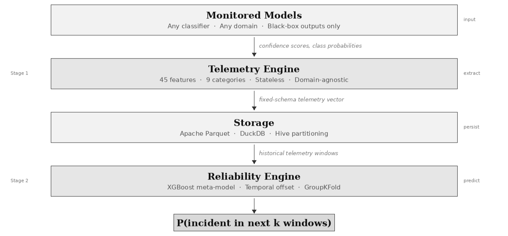
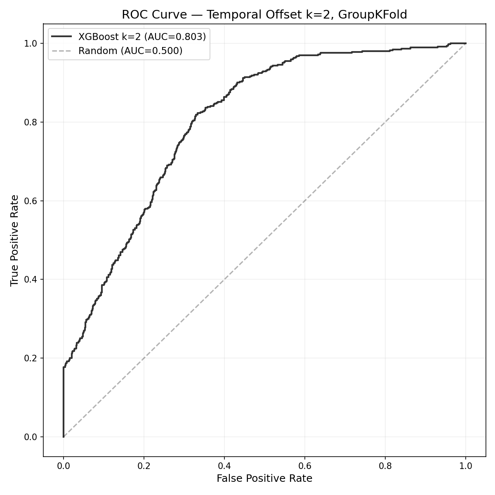
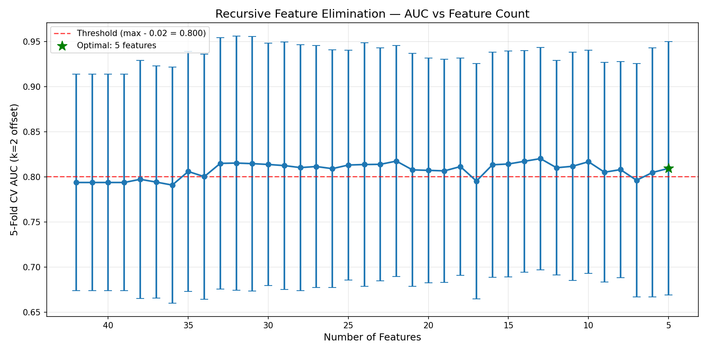
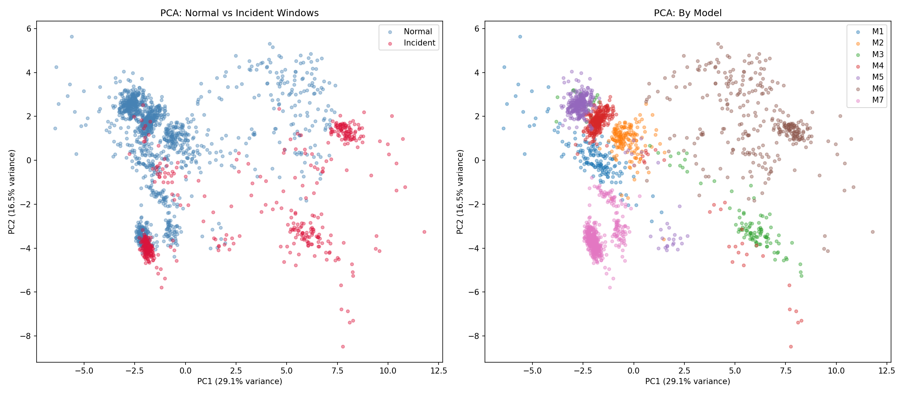

# Before the Alerts Fire

## Production Models, Predictive Reliability, and the Case for Forecasting Failure

*By Shubhan Singh*

---

The model is still running.

The API responds. The predictions arrive on time. The dashboard is green. Nobody has filed a complaint. Nobody has noticed anything wrong.

And yet, somewhere in the gap between what the model was trained to do and what the world is currently asking of it, something has shifted.

The answers are worse than they used to be. Not broken. Not absent. Just quietly, consistently wrong in ways that won't show up in the logs, won't trigger any alerts, and won't be obvious until the damage has already accumulated in every downstream decision that trusted them.

I wish it to be a hypothetical.

Vela et al. (2022) studied 128 model–dataset pairs across healthcare, finance, transportation, and weather forecasting. 91% showed temporal quality degradation in production. The degradation patterns were varied — monotonic decline in some cases, periodic oscillation in others, sudden collapse in a few — but the consistency was damning. Models left unmonitored don't announce their decline. They erode.

That number sat with us for a while.

---

## How we monitor currently and where does it stop?

The tools exist. Evidently AI. WhyLabs. Arize. Fiddler. NannyML, and more. Good tools, genuinely. They watch your distributions, track your drift metrics, compare your incoming data against a reference baseline, and fire an alert when something crosses a threshold.

But here is what all of them have in common: they tell you about a problem after it has already started.

The alert fires because the drift has already happened. The performance estimate drops because the model has already been serving degraded predictions. You are not catching the failure. You are documenting it. The users who received the wrong answer before the alert fired — they already received the wrong answer.

That window of "silent-wrongness" is gone, and no amount of post-hoc analysis recovers it.

There is a second limitation that gets less attention. The deeper capabilities in most monitoring platforms — the ones that move beyond "something changed" and begin to explain "here is why" — require access to model internals. Weights. Training data. Embedding vectors. Feature pipelines. SHAP values.

Most of the world's deployed ML doesn't work that way.

A hospital using a vendor's diagnostic model doesn't get the weights.
A bank running third-party credit scoring doesn't get the training data.
A logistics company relying on an external demand forecast gets predictions, and nothing else.

These organizations are the ones most affected by model degradation, and they are quite literally the last to know it's happening. The tools that could help them require access they will never have.

If you map the current landscape on two axes: reactive versus predictive, and black-box versus internals-required, a pattern emerges.

*The ML monitoring landscape mapped on two axes; the bottom-right is where the current tools rest, and where our work starts.*

The bottom-right quadrant is vacant. Predictive monitoring that works without model access. That's the space we built into.

---

## Stealing from the Turbine Engineers

There is an industry that has been solving a structurally identical problem for decades, and it has nothing to do with machine learning.

Predictive Maintenance. Turbines, engines, production lines. The equipment runs continuously. Failure is expensive. Downtime is measured in thousands of dollars per hour. Waiting for something to break before intervening is not a strategy — it is a liability.

So engineers instrument the equipment with sensors. External sensors, nothing invasive. They collect continuous readings from observable behavior — vibration patterns, temperature gradients, pressure fluctuations — extract statistical features from those signals, and train models to forecast the probability of failure before it occurs. The equipment's internals are never opened. The model doesn't need to understand how the turbine works. It just needs to watch what the turbine does.

The structural analogy is direct. In predictive maintenance, sensors produce continuous readings from physical equipment. In our case, prediction outputs produce continuous telemetry from ML models.

In both cases, the monitoring system never inspects the internals of the system being monitored. It observes only the externally measurable signals.

As far as we could find across the literature from 2022 to 2026, nobody had applied this paradigm to machine learning models. So we tried.

---

## EquiLens

EquiLens treats a deployed ML model the way a predictive maintenance system treats a turbine.

The prediction outputs — confidence scores, class probabilities, the patterns in how a model distributes certainty across its outputs — become the sensors. Statistical features extracted from those outputs become the derived signals.

A trained meta-model learns from those signals and outputs a single number: the probability that a reliability incident will occur in the next *k* prediction windows.

Before it happens. Not after.

No model weights accessed.
No training data examined.
No raw predictions stored.

We're only storing derived statistical aggregates, kilobytes per window regardless of what the underlying model processes.

Thus, it works on any classifier: binary, multi-class, multi-label, text, image, tabular. The monitored model is a black box. That is the point.

That is the only version of this that scales to where ML is actually being deployed.

*Prediction outputs flow through a stateless telemetry engine, are persisted as Parquet files, and feed a trained meta-model that forecasts reliability incidents.*

The system works in two stages.

The first — the Telemetry Engine — is stateless and domain-agnostic. It accepts prediction outputs from any classifier and computes a fixed-schema feature vector per time window. The same vector, the same schema, regardless of whether the model is classifying movie reviews or identifying objects in satellite imagery.

The feature vector spans 45 metrics across nine categories: distributional drift, prediction uncertainty, confidence distribution properties, prediction behaviour patterns, output stability, behavioural divergence across subgroups, temporal dynamics, anomaly and data quality indicators, and operational signals.

Every one of these is derived entirely from the model's prediction outputs. Nothing from inside the model. Nothing from the input data.

The second stage — the Reliability Engine — is a trained XGBoost model that takes those vectors as input and outputs an incident probability for future windows.

The shift from detection to forecasting is the whole point. Detection tells you the model is already failing. Forecasting tells you it is *about to*.

---

## How we tested it

We selected seven pre-trained HuggingFace models as the monitored systems — deliberately diverse in architecture, task & output dimensionality.

Binary sentiment classification.
Multi-class emotion detection.
Natural language inference at two different model scales.
A Vision Transformer classifying across a thousand categories.
Multi-label toxicity detection with real demographic annotations.

Each model was exposed to five distinct data streams designed to simulate the distributional shifts that occur in real deployments: in-domain baseline, domain shift, register change, topic transfer, and format variation.

35 independent collection runs.
1,880 telemetry windows.
464 labelled incidents across the full dataset.

An early implementation decision shaped the entire pipeline. HuggingFace's high-level `pipeline` API returned only top-1 probabilities for several model architectures, which blocked a significant portion of the telemetry features.

We abandoned it in favor of direct model access — extracting full probability distributions via manual softmax over logits. That one decision unlocked entropy, calibration, and distributional divergence metrics that would have remained invisible otherwise.

---

## Everything broke. Twice.

This is the part of the story that matters most, and the part that most project write-ups would skip.

Our first training run produced AUC = 1.000 on every evaluation. Every fold. Every metric. Perfect.

A perfect score on a novel ML task is not cause for celebration.
It is cause for suspicion, and we were suspicious.

Investigation revealed the root cause: our incident labels were deterministic functions of the training features.

The labelling heuristic used threshold rules on metrics that were also serving as inputs to the model. XGBoost hadn't learned to predict reliability incidents. It had learned to reverse-engineer the threshold rules that generated the labels.

Given the same features that produced the label, of course it could reconstruct the label perfectly. It wasn't forecasting. It was pattern-matching a lookup table.

The fix was temporal offset.
Instead of training the model to predict the label at the same window it was observing, we shifted the target: features extracted at window *t* now predict the label at window *t+k*.

The telemetry distributions shift between windows, so features at time *t* can no longer deterministically produce the label at a future window. The model has to learn genuine temporal patterns — "these signals tend to precede incidents" rather than "these signals *are* the incident."

AUC dropped from 1.000 to 0.885. Progress. But still suspiciously high.

We kept digging, and there it was, the second problem, it was subtler: cross-validation leakage through autocorrelated windows.

Standard k-fold CV randomly shuffles data points into folds. But our data points were sequential telemetry windows from the same data stream. Consecutive windows from the same model, processing the same dataset, are nearly identical — same confidence patterns, same drift trajectory, one batch apart.

Random shuffling scattered these neighbours across folds. XGBoost found the near-identical neighbour in the training set, copied its label, and scored perfectly. It wasn't generalising. It was memorising neighbours.

The fix was GroupKFold — grouping all windows from the same data stream into the same fold. With 35 unique streams distributed across 5 folds, entire streams stayed together.

No neighbour leakage.
The model had to generalise across streams, not memorise within them.

AUC dropped from 0.885 to 0.794.

> *AUC = 1.00 — label circularity discovered. Fix: temporal offset.*
> *AUC = 0.88 — CV leakage discovered. Fix: GroupKFold.*
> *AUC = 0.79 — honest.*

Three rounds of "the number got worse."
Each one a better number.
The final AUC of 0.794 is lower, but it is earned.
We can defend every digit of it.

There was a third correction too. Standalone 5-fold cross-validation, even with GroupKFold applied, still produced AUC = 1.000 — because streams from the same model correlate strongly enough that patterns from one stream transfer perfectly to another, regardless of grouping. It could not produce honest discrimination estimates, so we removed it entirely from the evaluation pipeline.

Three evaluations survived, each answering one question, each producing numbers we trust.

---

## What the numbers say

**Lead time.**
At two windows of temporal offset, the system achieves AUC = 0.794, outperforming a naive threshold-based detection baseline (0.749) by +0.045. The AUC degrades gracefully from k=1 to k=3 rather than collapsing, indicating that current telemetry carries genuine information about future reliability state. The system provides advance warning before a threshold-based detector would identify the same incident.

*ROC curve at two windows of lead time. AUC = 0.803, aggregated across GroupKFold splits with temporal offset k=2.*

**Cross-domain transfer.**
A meta-model trained on six text classifiers predicts incidents on a completely held-out seventh with AUC ≥ 0.997. Near-perfect within-modality transfer, without any exposure to the target model during training. But transfer to the vision model drops to 0.626 — above chance, but meaningfully below the text models. With only one vision model in the training set, the result says "you can't generalize to a modality you've never observed," not "vision telemetry is fundamentally different." We are not pretending otherwise.

**Feature selection.**
This was the most structurally interesting finding. Starting from 42 training features, we applied recursive feature elimination — removing the least important feature at each step, retraining, and recording the AUC. The curve didn't drop. It *rose* — peaking with roughly a third of the original features, then settling at a handful that carried essentially the same predictive signal as the full set. 88% of the feature space was noise. The surviving features clustered in the drift and confidence families. The temporal, anomaly, and operational categories contributed almost nothing under the current evaluation setup.

*Recursive Feature Elimination curve showing AUC as features are removed from 42 to 5.*

The practical implication is immediate: inference-time monitoring can be reduced to a small number of statistics per window, enabling lightweight deployment on resource-constrained infrastructure.

*PCA projection; Left: colored by incident status (partial separation). Right: coloured by model identity (M6 vision clearly separated from text models).*

The PCA projection of the telemetry space confirmed these findings visually. Incident and normal windows show partial but meaningful separation — consistent with 0.794, not 1.000.

When coloured by model identity, each model occupies a distinct cluster, with the vision model sitting in a clearly different region from the text models. This spatial separation directly explains the cross-domain transfer results.

---

## What we don't know yet

We have been deliberate about drawing a clear line between what we can claim and what we cannot.

**The labels are synthetic.**
Our incident labelling heuristic uses threshold rules on telemetry metrics — which creates a proxy for failure, not a measurement of it. Temporal offset prevents direct circularity, but the system is currently predicting whether those threshold rules will trigger in future windows, not whether the model will actually produce incorrect predictions. Those are related but not identical questions. Phase 2 replaces these proxies with accuracy-based labels computed from real dataset ground truth during offline training, while preserving fully black-box operation at inference time. This is the single highest-priority improvement.

**The vision gap is real.**
One vision model is not enough to generalize across modalities. Adding more vision architectures to the training set will clarify whether cross-modality transfer is genuinely limited or simply data-starved.

**The variance is high.**
±0.120 standard deviation on the primary result reflects real fold-to-fold variation. With 35 stream groups across 5 folds, each fold's composition significantly affects the outcome. A larger, more diverse training set would reduce this.

**Some features are silent in the lab.**
A small number of the 45 features are always zero in controlled experiments. They measure production phenomena — variable traffic patterns, ground truth feedback loops, occasional inference failures — that simply don't exist in a laboratory setting. Their predictive value remains untested until the system runs in a real deployment.

---

## What comes next

Beyond accuracy-based labels and expanded model diversity, two directions interest us most.

**Temporal sequence modelling.**
The current meta-model treats each window independently. An LSTM or Transformer layer processing sequences of consecutive telemetry windows would capture degradation trajectories that single-window snapshots miss. Some failures don't spike — they develop gradually, with drift rising steadily, confidence declining incrementally, entropy accelerating. An ensemble combining the snapshot view (what is happening now) with the trajectory view (is it getting worse) could improve discrimination in the ambiguous zone where the current model struggles.

**Failure archetypes.**
The system currently outputs a probability. What we want is a probability with a reason. The PCA visualization already shows at least two separable failure patterns — incidents dominated by distributional drift versus incidents dominated by confidence collapse. Formal clustering on incident-labelled windows could identify distinct archetypes, transforming the output from "something will go wrong" to "distributional drift is accelerating and will likely breach thresholds within two windows." Not by opening the model. By recognizing patterns on the outside.

And eventually — self-monitoring.
A monitoring system that cannot detect its own degradation is operationally fragile.

If the incoming telemetry distribution shifts beyond what the meta-model was trained on, its predictions lose meaning. Tracking the distribution of the meta-model's own output scores over time — watching whether they cluster near 0.5 instead of separating toward the extremes — would apply the same telemetry principles one level up. The monitor monitoring itself.

---

## Why this matters

The monitoring gap is not a gap in tooling. The tools exist. It is a gap in what the tools are trying to do.

They are built to detect. Detection is reactive by definition.

The question we are asking is whether the telemetry that a model produces in normal operation — the patterns in how it assigns confidence, how its distributions evolve, how early signals accumulate before a visible failure — contains enough information to forecast that failure before it becomes apparent to any detector.

Phase 1 says yes.

The predictive maintenance analogy is not just a framing device.

It is a claim: that the paradigm proven at industrial scale, for physical equipment, applies to the software equivalent.

Prediction outputs are sensors. Telemetry features are derived signals. The meta-model is a failure predictor. The monitored "equipment" is a neural network instead of a turbine, but the statistical infrastructure is the same.

We are not the first to monitor ML models. We are, as far as we can tell after surveying the literature from 2022 to 2026, the first to try predicting their failures from the outside.

---

The alerts haven't fired yet. That's the window we're trying to work in.

---

*EquiLens is a research project in active development. Phase 1 is complete. A full research paper is forthcoming.*

*Built by Shubhan Singh — BTech Computer Engineering, NMIMS Navi Mumbai.*

*If you've dealt with silent model degradation in production, or if you're building in the ML observability space, I'd like to hear from you. This is early work, and the best version of it will be shaped by the people who need it most.*

*Follow the [public repository](https://github.com/shhuuubh-04/equilens-public) for updates, stories, and what's next.*